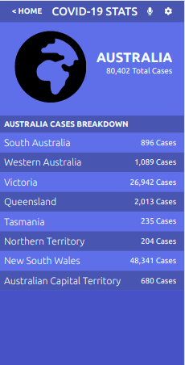

# Covid-19 Information (Metric WebApp)

This SPA (Mobile APP) gets it's data from the [Narrativa](https://covid19tracking.narrativa.com/index_en.html) API, and displays data regarding Covid-19 Stats.

## Additional description of the project and its features.

This is my React/Redux Capstone project. Please find full details [here](https://github.com/microverseinc/curriculum-react-redux/blob/main/capstone/react_capstone.md).

### Milestones:

- Use React documentation.
- Use React components.
- Use React props.
- Use React Router.
- Connect React and Redux.
- Handle events in a React app.
- Write integration tests with a React testing library.
- Use styles in a React app.
- Use React life cycle methods.
- Apply React best practices and language style guides in code.
- Use store, actions and reducers in React.

## 🔴  Live Demo

[Covid-19 Information](https://adoring-jang-de4a24.netlify.app/)

## Built With

- React, React Router, Redux, Redux Logger, Webpack, Behance, Javascript, React testing library, Babel and Jest

## Getting Started

To get a local copy up and running follow these simple steps inside the root folder.

### Setup

Go to this repository on [GitHub](https://github.com/sneeu-leeu/covid-19-information/tree/Project).

Clone the project by running:
'$ git clone <HTTPS or SSH Code found on page>'

Change the directory to the repository:
'$ cd "your path/Covid-19-Information"

Install dependencies with:
'$ npm install'

### Usage

Start server with:
'$ npm start'

it will open `http://localhost:3000/` in your default browser.

Run tests with:
'$ npm test'

## Author

👤 **Stephan**

Github: [@sneeu-leeu](https://github.com/sneeu-leeu)

Twitter: [@Stephan07484055](https://twitter.com/Stephan07484055)

LinkedIn: [Stephan Annandale](https://www.linkedin.com/in/stephan-annandale-a4b4931a9/)

## 🤝 Contributing

Contributions, issues and feature requests are welcome!

Feel free to check the [issues page]().

## Show your support

Give a ⭐️ if you like this project!

## Acknowledgments

- Microverse for the motivation
- Original design idea by Nelson Sakwa on Behance.

## 📝 License

This project is MIT Lisenced